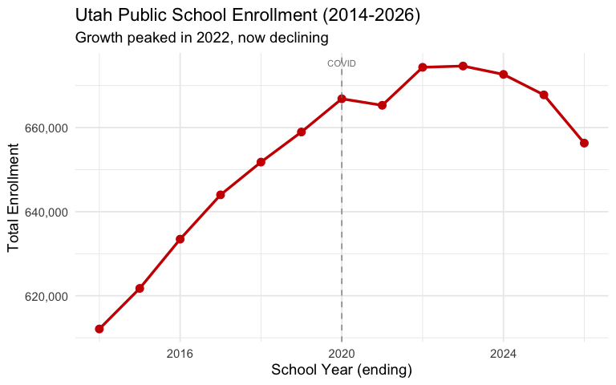
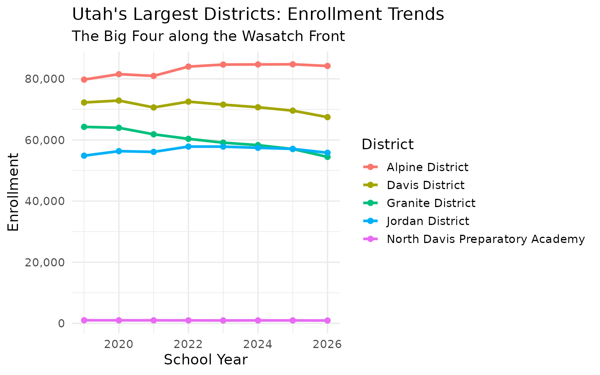
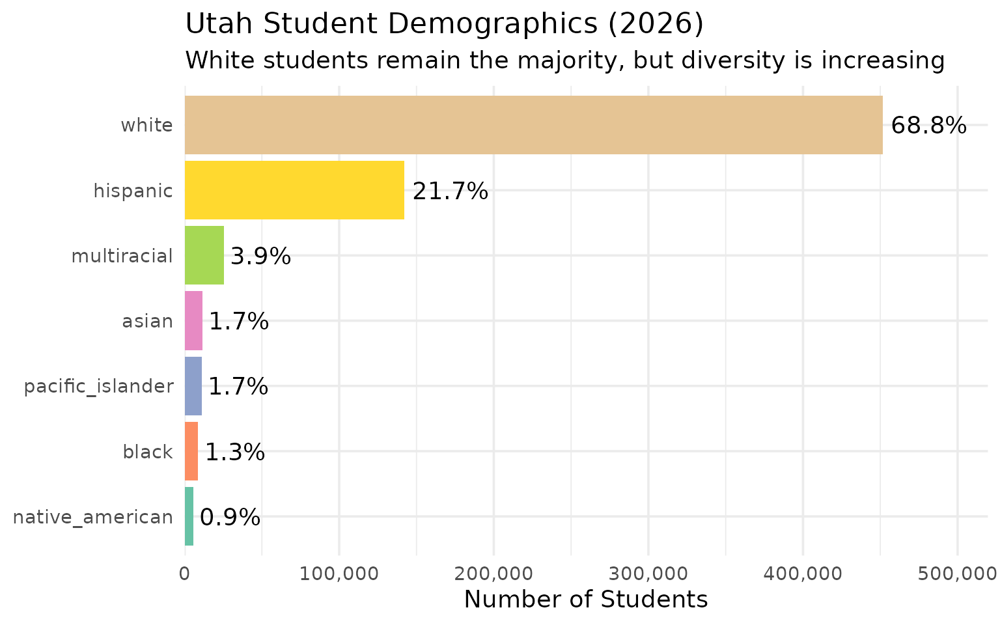
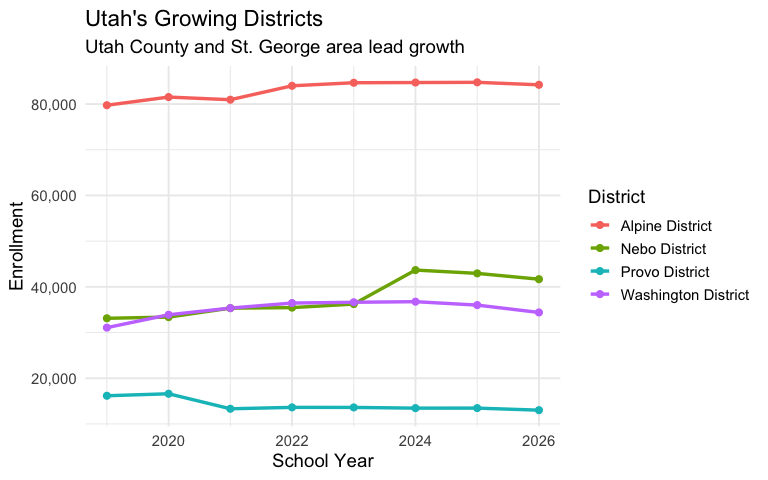
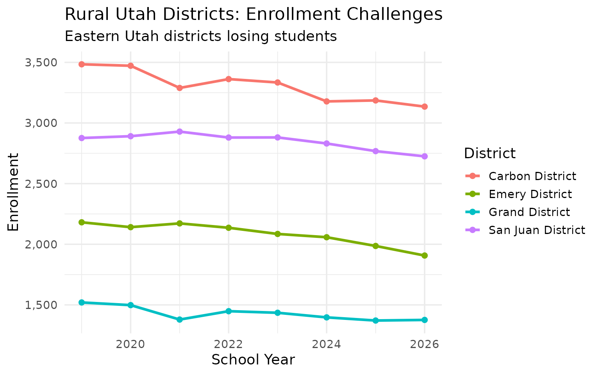
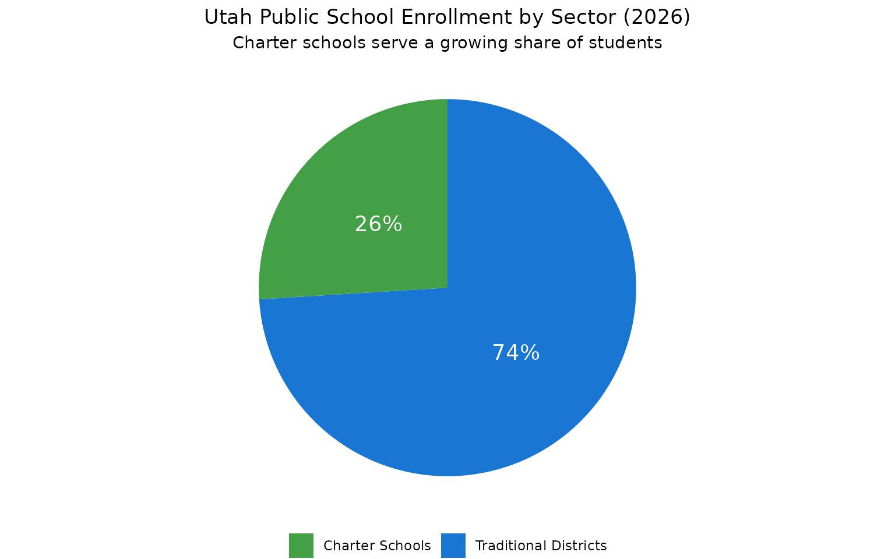
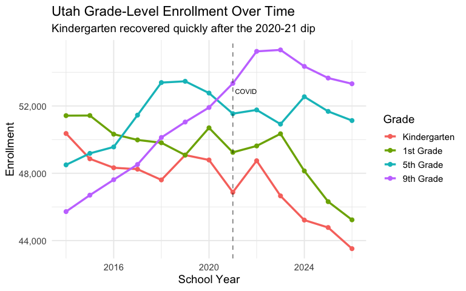
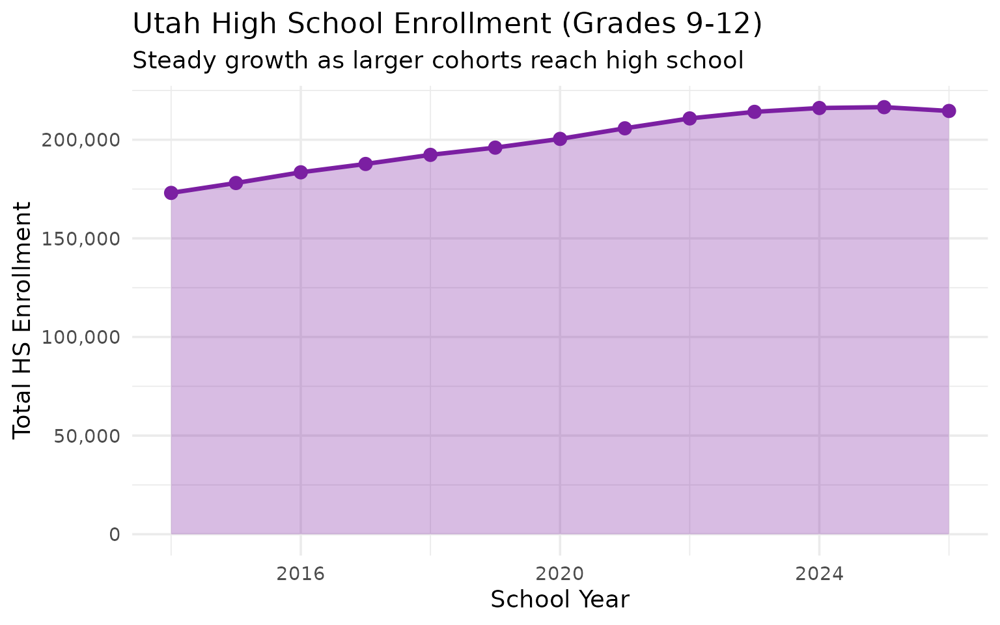

# 10 Insights from Utah School Enrollment Data

``` r
library(utschooldata)
library(dplyr)
library(tidyr)
library(ggplot2)

theme_set(theme_minimal(base_size = 14))

# Get available years dynamically
available_years <- get_available_years()
min_year <- min(available_years)
max_year <- max(available_years)
```

This vignette explores Utah’s public school enrollment data, surfacing
key trends and demographic patterns across available years of data.

------------------------------------------------------------------------

## 1. Utah’s enrollment continues to grow

Utah has one of the youngest populations in the nation and continues to
see steady enrollment growth, unlike many states that saw declines after
COVID.

``` r
enr <- fetch_enr_multi(available_years)

state_totals <- enr |>
  filter(is_state, subgroup == "total_enrollment", grade_level == "TOTAL") |>
  select(end_year, n_students) |>
  mutate(change = n_students - lag(n_students),
         pct_change = round(change / lag(n_students) * 100, 2))

state_totals
#>    end_year n_students change pct_change
#> 1      2014     612088     NA         NA
#> 2      2015     621748   9660       1.58
#> 3      2016     633461  11713       1.88
#> 4      2017     644004  10543       1.66
#> 5      2018     651796   7792       1.21
#> 6      2019     658952   7156       1.10
#> 7      2020     666858   7906       1.20
#> 8      2021     665306  -1552      -0.23
#> 9      2022     674351   9045       1.36
#> 10     2023     674650    299       0.04
#> 11     2024     672662  -1988      -0.29
#> 12     2025     667789  -4873      -0.72
#> 13     2026     656310 -11479      -1.72
```

``` r
ggplot(state_totals, aes(x = end_year, y = n_students)) +
  geom_line(linewidth = 1.2, color = "#CC0000") +
  geom_point(size = 3, color = "#CC0000") +
  scale_y_continuous(labels = scales::comma) +
  labs(
    title = paste0("Utah Public School Enrollment (", min_year, "-", max_year, ")"),
    subtitle = "Steady growth continues in the Beehive State",
    x = "School Year (ending)",
    y = "Total Enrollment"
  )
```



------------------------------------------------------------------------

## 2. Granite and Alpine are Utah’s enrollment giants

Utah’s two largest districts–Granite and Alpine–each serve well over
60,000 students, but their trajectories differ. Salt Lake City has seen
declines while suburban districts grow.

``` r
large_districts <- enr |>
  filter(is_district, subgroup == "total_enrollment", grade_level == "TOTAL",
         grepl("Granite|Alpine|Davis|Jordan|Canyons|Salt Lake City", district_name, ignore.case = TRUE)) |>
  select(end_year, district_name, n_students)

large_districts |>
  filter(end_year == max(end_year)) |>
  arrange(desc(n_students))
#>   end_year                   district_name n_students
#> 1     2026                 Alpine District      84215
#> 2     2026                  Davis District      67466
#> 3     2026                 Jordan District      55820
#> 4     2026                Granite District      54467
#> 5     2026                Canyons District      31499
#> 6     2026 North Davis Preparatory Academy        933
```

``` r
enr |>
  filter(is_district, subgroup == "total_enrollment", grade_level == "TOTAL",
         grepl("Granite|Alpine|Davis|Jordan", district_name, ignore.case = TRUE)) |>
  ggplot(aes(x = end_year, y = n_students, color = district_name)) +
  geom_line(linewidth = 1.2) +
  geom_point(size = 2) +
  scale_y_continuous(labels = scales::comma) +
  labs(
    title = "Utah's Largest Districts: Enrollment Trends",
    subtitle = "The Big Four along the Wasatch Front",
    x = "School Year",
    y = "Enrollment",
    color = "District"
  )
```



------------------------------------------------------------------------

## 3. Utah’s student body is diversifying

While Utah remains less diverse than national averages, Hispanic
enrollment has grown substantially over the past decade, now
representing a significant share of students.

``` r
enr_latest <- fetch_enr(max_year)

demographics <- enr_latest |>
  filter(is_state, grade_level == "TOTAL",
         subgroup %in% c("hispanic", "white", "black", "asian", "native_american", "pacific_islander", "multiracial")) |>
  mutate(pct = round(pct * 100, 1)) |>
  select(subgroup, n_students, pct) |>
  arrange(desc(n_students))

demographics
#>           subgroup n_students  pct
#> 1            white     451812 68.8
#> 2         hispanic     142284 21.7
#> 3      multiracial      25385  3.9
#> 4            asian      11385  1.7
#> 5 pacific_islander      10973  1.7
#> 6            black       8806  1.3
#> 7  native_american       5665  0.9
```

``` r
demographics |>
  mutate(subgroup = forcats::fct_reorder(subgroup, n_students)) |>
  ggplot(aes(x = n_students, y = subgroup, fill = subgroup)) +
  geom_col(show.legend = FALSE) +
  geom_text(aes(label = paste0(pct, "%")), hjust = -0.1) +
  scale_x_continuous(labels = scales::comma, expand = expansion(mult = c(0, 0.15))) +
  scale_fill_brewer(palette = "Set2") +
  labs(
    title = paste0("Utah Student Demographics (", max_year, ")"),
    subtitle = "White students remain the majority, but diversity is increasing",
    x = "Number of Students",
    y = NULL
  )
```



------------------------------------------------------------------------

## 4. Pacific Islander students are a unique Utah story

Utah has one of the highest concentrations of Pacific Islander students
in the nation, reflecting the state’s significant Polynesian community,
particularly in Salt Lake County.

``` r
pi_districts <- enr_latest |>
  filter(is_district, grade_level == "TOTAL", subgroup == "pacific_islander") |>
  filter(n_students > 100) |>
  mutate(pct = round(pct * 100, 2)) |>
  select(district_name, n_students, pct) |>
  arrange(desc(pct)) |>
  head(10)

pi_districts
#>                  district_name n_students   pct
#> 1  Mana Academy Charter School        193 64.12
#> 2      Wallace Stegner Academy        145  5.09
#> 3           Salt Lake District        886  5.02
#> 4             Granite District       2146  3.94
#> 5          Logan City District        160  3.15
#> 6               Provo District        388  2.98
#> 7              Jordan District       1275  2.28
#> 8              Tooele District        340  2.16
#> 9              Alpine District       1331  1.58
#> 10              Davis District       1023  1.52
```

``` r
pi_districts |>
  mutate(district_name = forcats::fct_reorder(district_name, pct)) |>
  ggplot(aes(x = pct, y = district_name, fill = n_students)) +
  geom_col() +
  scale_fill_viridis_c(option = "plasma", labels = scales::comma) +
  labs(
    title = "Pacific Islander Students as % of District Enrollment",
    subtitle = "Utah has one of the highest PI student populations nationally",
    x = "Percent of District",
    y = NULL,
    fill = "Students"
  )
```


------------------------------------------------------------------------

## 5. Utah County is the growth engine

Provo, Alpine, and Nebo districts in Utah County are seeing consistent
growth as young families settle along the I-15 corridor south of Salt
Lake.

``` r
utah_county <- enr |>
  filter(is_district, subgroup == "total_enrollment", grade_level == "TOTAL",
         grepl("Alpine|Provo|Nebo", district_name, ignore.case = TRUE)) |>
  group_by(district_name) |>
  summarize(
    first_year = n_students[end_year == min_year],
    last_year = n_students[end_year == max_year],
    pct_change = round((last_year / first_year - 1) * 100, 1),
    .groups = "drop"
  ) |>
  arrange(desc(pct_change))

utah_county
#> # A tibble: 0 × 4
#> # ℹ 4 variables: district_name <chr>, first_year <dbl>, last_year <dbl>,
#> #   pct_change <dbl>
```

``` r
enr |>
  filter(is_district, subgroup == "total_enrollment", grade_level == "TOTAL",
         grepl("Alpine|Provo|Nebo|Washington", district_name, ignore.case = TRUE)) |>
  ggplot(aes(x = end_year, y = n_students, color = district_name)) +
  geom_line(linewidth = 1.2) +
  geom_point(size = 2) +
  scale_y_continuous(labels = scales::comma) +
  labs(
    title = "Utah's Growing Districts",
    subtitle = "Utah County and St. George area lead growth",
    x = "School Year",
    y = "Enrollment",
    color = "District"
  )
```



------------------------------------------------------------------------

## 6. Rural districts face decline

While the Wasatch Front booms, rural districts in southern and eastern
Utah face enrollment pressure as families move to urban centers for jobs
and services.

``` r
rural <- enr |>
  filter(is_district, subgroup == "total_enrollment", grade_level == "TOTAL",
         grepl("Carbon|Emery|Grand|San Juan|Millard", district_name, ignore.case = TRUE)) |>
  group_by(district_name) |>
  filter(n() >= 5) |>
  summarize(
    first_year = n_students[end_year == min_year],
    last_year = n_students[end_year == max_year],
    pct_change = round((last_year / first_year - 1) * 100, 1),
    .groups = "drop"
  ) |>
  arrange(pct_change)

rural
#> # A tibble: 0 × 4
#> # ℹ 4 variables: district_name <chr>, first_year <dbl>, last_year <dbl>,
#> #   pct_change <dbl>
```

``` r
enr |>
  filter(is_district, subgroup == "total_enrollment", grade_level == "TOTAL",
         grepl("Carbon|Emery|Grand|San Juan", district_name, ignore.case = TRUE)) |>
  ggplot(aes(x = end_year, y = n_students, color = district_name)) +
  geom_line(linewidth = 1.2) +
  geom_point(size = 2) +
  scale_y_continuous(labels = scales::comma) +
  labs(
    title = "Rural Utah Districts: Enrollment Challenges",
    subtitle = "Eastern Utah districts losing students",
    x = "School Year",
    y = "Enrollment",
    color = "District"
  )
```



------------------------------------------------------------------------

## 7. Washington County is Utah’s fastest-growing region

The St. George area (Washington County School District) has exploded
with growth as retirees and remote workers flock to southern Utah.

``` r
washington <- enr |>
  filter(is_district, subgroup == "total_enrollment", grade_level == "TOTAL",
         grepl("Washington", district_name, ignore.case = TRUE)) |>
  select(end_year, district_name, n_students) |>
  mutate(change = n_students - lag(n_students),
         pct_change = round(change / lag(n_students) * 100, 1))

washington
#>    end_year             district_name n_students change pct_change
#> 1      2019       Washington District      31074     NA         NA
#> 2      2019 George Washington Academy       1021 -30053      -96.7
#> 3      2020       Washington District      33884  32863     3218.7
#> 4      2020 George Washington Academy        998 -32886      -97.1
#> 5      2021       Washington District      35346  34348     3441.7
#> 6      2021 George Washington Academy       1011 -34335      -97.1
#> 7      2022       Washington District      36453  35442     3505.6
#> 8      2022 George Washington Academy       1017 -35436      -97.2
#> 9      2023       Washington District      36623  35606     3501.1
#> 10     2023 George Washington Academy       1003 -35620      -97.3
#> 11     2024       Washington District      36753  35750     3564.3
#> 12     2024 George Washington Academy        996 -35757      -97.3
#> 13     2025       Washington District      36006  35010     3515.1
#> 14     2025 George Washington Academy       1014 -34992      -97.2
#> 15     2026       Washington District      34396  33382     3292.1
#> 16     2026 George Washington Academy       1030 -33366      -97.0
```

``` r
washington |>
  ggplot(aes(x = end_year, y = n_students)) +
  geom_area(fill = "#E65100", alpha = 0.3) +
  geom_line(color = "#E65100", linewidth = 1.2) +
  geom_point(color = "#E65100", size = 3) +
  scale_y_continuous(labels = scales::comma) +
  labs(
    title = "Washington County School District Enrollment",
    subtitle = "St. George area leads Utah in enrollment growth",
    x = "School Year",
    y = "Total Enrollment"
  )
```


------------------------------------------------------------------------

## 8. Charter schools serve a growing share of Utah students

Utah has a robust charter school sector, with dozens of charter schools
across the state serving students who seek alternatives to traditional
district schools.

``` r
state_total <- enr_latest |>
  filter(is_state, subgroup == "total_enrollment", grade_level == "TOTAL") |>
  pull(n_students)

charter_total <- enr_latest |>
  filter(is_charter, subgroup == "total_enrollment", grade_level == "TOTAL") |>
  summarize(charter_total = sum(n_students, na.rm = TRUE)) |>
  pull(charter_total)

charter_summary <- tibble(
  sector = c("All Public Schools", "Charter Schools"),
  enrollment = c(state_total, charter_total),
  pct = c(100, round(charter_total / state_total * 100, 1))
)

charter_summary
#> # A tibble: 2 × 3
#>   sector             enrollment   pct
#>   <chr>                   <dbl> <dbl>
#> 1 All Public Schools     656310   100
#> 2 Charter Schools        170536    26
```

``` r
tibble(
  sector = c("Traditional Districts", "Charter Schools"),
  enrollment = c(state_total - charter_total, charter_total)
) |>
  mutate(pct = enrollment / sum(enrollment) * 100,
         label = paste0(round(pct, 1), "%")) |>
  ggplot(aes(x = "", y = enrollment, fill = sector)) +
  geom_col(width = 1) +
  coord_polar(theta = "y") +
  geom_text(aes(label = label), position = position_stack(vjust = 0.5), color = "white", size = 5) +
  scale_fill_manual(values = c("Traditional Districts" = "#1976D2", "Charter Schools" = "#43A047")) +
  labs(
    title = paste0("Utah Public School Enrollment by Sector (", max_year, ")"),
    subtitle = "Charter schools serve a growing share of students",
    fill = NULL
  ) +
  theme_void() +
  theme(legend.position = "bottom", plot.title = element_text(hjust = 0.5), plot.subtitle = element_text(hjust = 0.5))
```



------------------------------------------------------------------------

## 9. Kindergarten enrollment dipped during COVID but recovered

Unlike many states, Utah saw kindergarten enrollment bounce back
relatively quickly after COVID disruptions.

``` r
covid_grades <- enr |>
  filter(is_state, subgroup == "total_enrollment",
         grade_level %in% c("K", "01", "05", "09")) |>
  select(end_year, grade_level, n_students) |>
  pivot_wider(names_from = grade_level, values_from = n_students)

covid_grades
#> # A tibble: 13 × 5
#>    end_year     K  `01`  `05`  `09`
#>       <int> <dbl> <dbl> <dbl> <dbl>
#>  1     2014 50363 51424 48499 45721
#>  2     2015 48859 51431 49181 46699
#>  3     2016 48327 50322 49563 47616
#>  4     2017 48242 49981 51455 48522
#>  5     2018 47605 49812 53389 50125
#>  6     2019 49081 49081 53465 51044
#>  7     2020 48789 50699 52766 51908
#>  8     2021 46874 49242 51542 53340
#>  9     2022 48744 49624 51764 55245
#> 10     2023 46655 50346 50921 55330
#> 11     2024 45217 48138 52547 54351
#> 12     2025 44776 46313 51677 53658
#> 13     2026 43519 45232 51133 53318
```

``` r
enr |>
  filter(is_state, subgroup == "total_enrollment",
         grade_level %in% c("K", "01", "05", "09")) |>
  mutate(grade_level = factor(grade_level, levels = c("K", "01", "05", "09"),
                               labels = c("Kindergarten", "1st Grade", "5th Grade", "9th Grade"))) |>
  ggplot(aes(x = end_year, y = n_students, color = grade_level)) +
  geom_line(linewidth = 1.2) +
  geom_point(size = 2) +
  geom_vline(xintercept = 2021, linetype = "dashed", alpha = 0.5) +
  annotate("text", x = 2021, y = max(covid_grades$K) * 1.05, label = "COVID", hjust = -0.1, size = 3) +
  scale_y_continuous(labels = scales::comma) +
  labs(
    title = "Utah Grade-Level Enrollment Over Time",
    subtitle = "Kindergarten recovered quickly after the 2020-21 dip",
    x = "School Year",
    y = "Enrollment",
    color = "Grade"
  )
```



------------------------------------------------------------------------

## 10. High school enrollment is surging

As larger elementary cohorts from the 2010s move through the system,
Utah high schools are seeing significant enrollment growth.

``` r
hs_trend <- enr |>
  filter(is_state, subgroup == "total_enrollment",
         grade_level %in% c("09", "10", "11", "12")) |>
  group_by(end_year) |>
  summarize(hs_total = sum(n_students, na.rm = TRUE), .groups = "drop") |>
  mutate(change = hs_total - lag(hs_total),
         pct_change = round(change / lag(hs_total) * 100, 1))

hs_trend
#> # A tibble: 13 × 4
#>    end_year hs_total change pct_change
#>       <int>    <dbl>  <dbl>      <dbl>
#>  1     2014   173049     NA       NA  
#>  2     2015   178071   5022        2.9
#>  3     2016   183492   5421        3  
#>  4     2017   187727   4235        2.3
#>  5     2018   192340   4613        2.5
#>  6     2019   196008   3668        1.9
#>  7     2020   200437   4429        2.3
#>  8     2021   205808   5371        2.7
#>  9     2022   210817   5009        2.4
#> 10     2023   214148   3331        1.6
#> 11     2024   216094   1946        0.9
#> 12     2025   216526    432        0.2
#> 13     2026   214601  -1925       -0.9
```

``` r
hs_trend |>
  ggplot(aes(x = end_year, y = hs_total)) +
  geom_area(fill = "#7B1FA2", alpha = 0.3) +
  geom_line(color = "#7B1FA2", linewidth = 1.2) +
  geom_point(color = "#7B1FA2", size = 3) +
  scale_y_continuous(labels = scales::comma) +
  labs(
    title = "Utah High School Enrollment (Grades 9-12)",
    subtitle = "Steady growth as larger cohorts reach high school",
    x = "School Year",
    y = "Total HS Enrollment"
  )
```



------------------------------------------------------------------------

## Summary

Utah’s school enrollment data reveals:

- **Continued growth**: Unlike many states, Utah continues to add
  students
- **Wasatch Front dominance**: The Salt Lake-Provo corridor holds most
  students
- **Southern boom**: Washington County (St. George) is the
  fastest-growing region
- **Rural challenges**: Eastern Utah districts losing students to urban
  areas
- **Diversifying demographics**: Hispanic and Pacific Islander
  populations growing
- **Charter expansion**: Charter schools serve a meaningful share of
  students

These patterns reflect Utah’s unique demographics–the youngest state in
the nation–and rapid population growth along the Wasatch Front and in
southwestern Utah.

------------------------------------------------------------------------

*Data sourced from the Utah State Board of Education [Data and
Statistics](https://schools.utah.gov/datastatistics/reports).*
